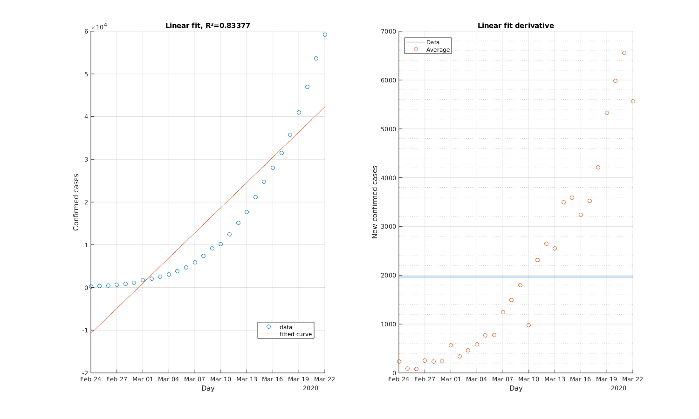
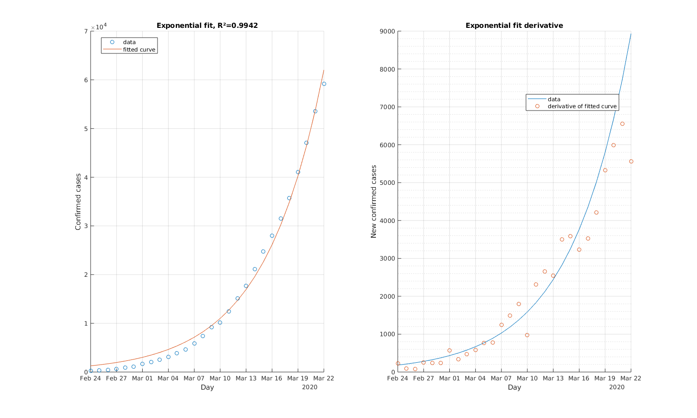
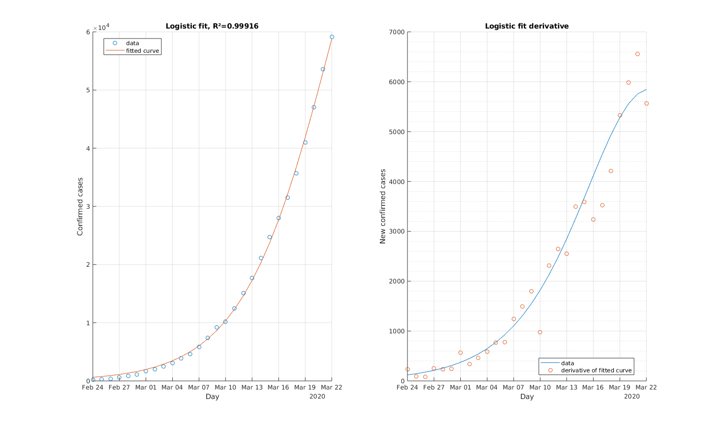
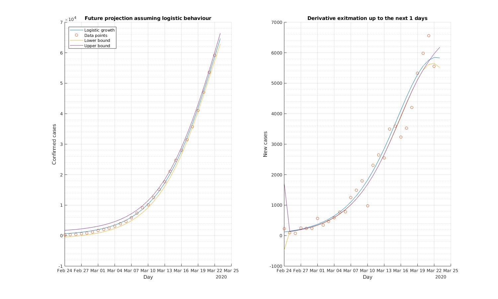
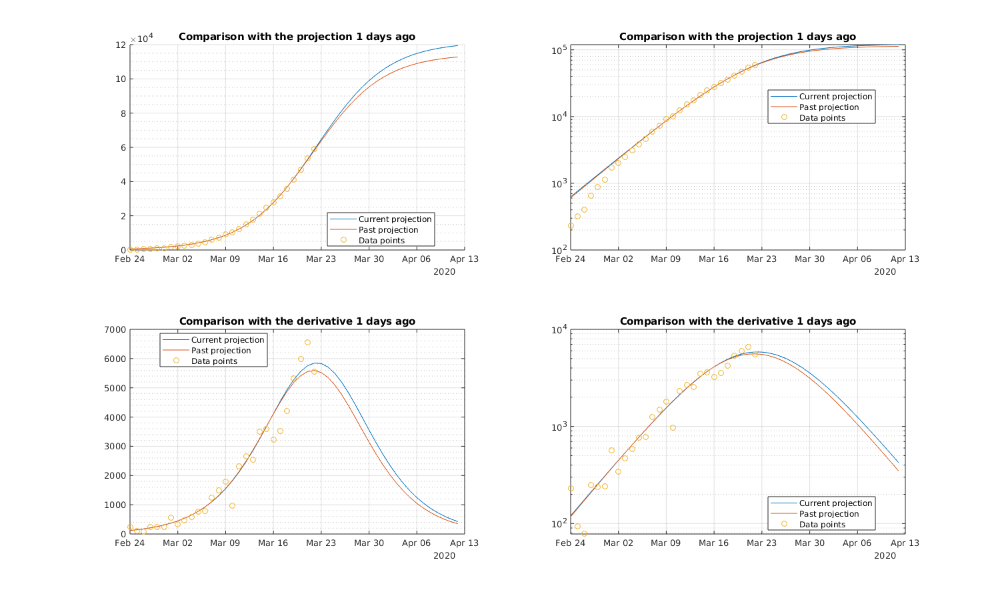

# COVID-19 spread
# Data
```matlab
breakdown = true;
if breakdown
    regione="Abruzzo";
    data_location = urlwrite("https://raw.githubusercontent.com/pcm-dpc/COVID-19/master/dati-regioni/dpc-covid19-ita-regioni.csv","./dati.csv") ;
else
    data_location = urlwrite("https://raw.githubusercontent.com/pcm-dpc/COVID-19/master/dati-andamento-nazionale/dpc-covid19-ita-andamento-nazionale.csv","./dati.csv") ;
end

dati=readtable(data_location);
delete dati.csv

if breakdown
    dati = dati(dati.denominazione_regione==regione, :);
end
dati = dati(:,{'data','totale_casi'});
dati.data = datetime(dati.data,"Format","uuuu-MM-dd'T'HH:mm:ss");

disp(dati)
```
```
           data            totale_casi
    ___________________    ___________

    2020-02-24T18:00:00          0    
    2020-02-25T18:00:00          0    
    2020-02-26T18:00:00          0    
    2020-02-27T18:00:00          1    
    2020-02-28T18:00:00          1    
    2020-02-29T17:00:00          2    
    2020-03-01T17:00:00          5    
    2020-03-02T18:00:00          5    
    2020-03-03T18:00:00          6    
    2020-03-04T17:00:00          7    
    2020-03-05T17:00:00          8    
    2020-03-06T17:00:00          9    
    2020-03-07T18:00:00         11    
    2020-03-08T18:00:00         17    
    2020-03-09T18:00:00         30    
    2020-03-10T18:00:00         38    
    2020-03-11T17:00:00         38    
    2020-03-12T17:00:00         84    
    2020-03-13T17:00:00         89    
    2020-03-14T17:00:00        112    
    2020-03-15T17:00:00        137    
    2020-03-16T17:00:00        176    
    2020-03-17T17:00:00        229    
```
```matlab
confirmed_cases = dati.totale_casi;
day_num = datenum(dati.data - dati.data(1));
CURRENT = day_num(end);
```
# Data fitting
```matlab
[linfit, lin_r] = fit(day_num, confirmed_cases, 'poly1');
[expfit, exp_r] = fit(day_num, confirmed_cases, 'exp1');
[logfit, log_r] = logisticFit(day_num, confirmed_cases);
```
# Plotting
## Linear fitting
```matlab
plot(linfit, day_num, confirmed_cases, "o")
grid on

title("Linear fit, R��="+lin_r.rsquare)
ylabel("Contagi")
xlabel("Giorni")
```



```matlab

disp(linfit.p1+" nuovi contagi ogni giorno")
```
```
7.818 nuovi contagi ogni giorno
```
```matlab
disp("Predicted new cases for tomorrow: "+round(linfit(CURRENT+1)-confirmed_cases(end)))
```
```
Predicted new cases for tomorrow: -92
```
## Exponential fitting
```matlab
plot(expfit, day_num, confirmed_cases, "o")
grid on

title("Exponential fit, R��="+exp_r.rsquare)
ylabel("Contagi")
xlabel("Giorni")
```



```matlab

disp("+"+expfit.b*100+"% nuovi contagi ogni giorno")
```
```
+25.3966% nuovi contagi ogni giorno
```
```matlab
disp("Predicted new cases for tomorrow: "+round(expfit(CURRENT+1)-confirmed_cases(end)))
```
```
Predicted new cases for tomorrow: 68
```
# Logistic fitting
```matlab
plot(logfit, day_num, confirmed_cases, "o")
grid on

title("Logistic fit, R��="+log_r.rsquare)
ylabel("Contagi")
xlabel("Giorni")
```



```matlab
variation=round(predint(logfit,CURRENT+1,0.95)-confirmed_cases(end));
disp("Predicted new cases for tomorrow: "+round(logfit(CURRENT+1)-confirmed_cases(end)));
```
```
Predicted new cases for tomorrow: 18
```
```matlab
disp("                                         95% confidence in range ["+variation(1) + " - "+ variation(2)+"]");
```
```
                                         95% confidence in range [2 - 34]
```
```matlab

```
# Future projections
```matlab
look_ahead_days = 7;
compare=false;
error_bars=true;

plot(0:(CURRENT+look_ahead_days),logfit(0:(CURRENT+look_ahead_days)))
hold on

grid on
grid minor
title("Future projection assuming logistic behaviour")
ylabel("Contagi")
xlabel("Giorni")
scatter(day_num,confirmed_cases)

legend({'Logistic growth','Data points'}, "Location","best");

if compare
    plot(0:(CURRENT+look_ahead_days),expfit(0:(CURRENT+look_ahead_days)))
    title("Future projection logistic vs exponential")
    legend({'Logistic growth','Data points', 'Exponential growth'}, "Location","best");
end
if error_bars
    log_ci = predint(logfit,1:(CURRENT+look_ahead_days),0.95);
    plot(1:(CURRENT+look_ahead_days),log_ci,'LineWidth',0.001);
    legend({'Logistic growth','Data points','Lower bound','Upper bound'}, "Location","best");

end
hold off
```



```matlab

```
# Confronto col passato:
```matlab
look_ahead_days = 1;
look_behind_days = 2;

model="Logistic";

reduced_day=day_num(1:(end-look_behind_days));
reduced_cases=confirmed_cases(1:(end-look_behind_days));

if model == "Logistic"
    model_current = logfit;
    model_past = logisticFit(reduced_day, reduced_cases );
else
    model_current = expfit;
    model_past = fit(reduced_day, reduced_cases, 'exp1');
end

plot(0:(CURRENT+look_ahead_days),model_current(0:(CURRENT+look_ahead_days)))
grid minor
hold on
plot(0:(CURRENT+look_ahead_days),model_past(0:(CURRENT+look_ahead_days)))
scatter(day_num, confirmed_cases)
title("Comparison with the projection "+look_behind_days+" days ago");
legend({'Current projection','Past projection','Data points'}, "Location","best");
hold off
```



```matlab

semilogy(0:(CURRENT+look_ahead_days),model_current(0:(CURRENT+look_ahead_days)))
grid minor
hold on
semilogy(0:(CURRENT+look_ahead_days),model_past(0:(CURRENT+look_ahead_days)))
scatter(day_num, confirmed_cases)
title("Comparison with the projection "+look_behind_days+" days ago");
legend({'Current projection','Past projection','Data points'}, "Location","best");
hold off
```


```matlab

```
